# Pipeline Lakehouse Cervejaria Delivery

Case Data Engineer | Azure Databricks, Delta Lake, PySpark, Kimball, Grafana

Pipeline end-to-end de analytics pra app de delivery de bebidas. Arquitetura Medallion (Bronze/Silver/Gold) com streaming + batch coexistindo, SCD na dim_data, framework de Data Quality em duas camadas, observabilidade via Grafana Cloud, governança via Unity Catalog, IaC e CI/CD.

**4.946 pedidos | 10.847 linhas na fact_vendas | 27 quality checks | 2m17s end-to-end | 7 tasks orquestradas em paralelo**

---

## Arquitetura

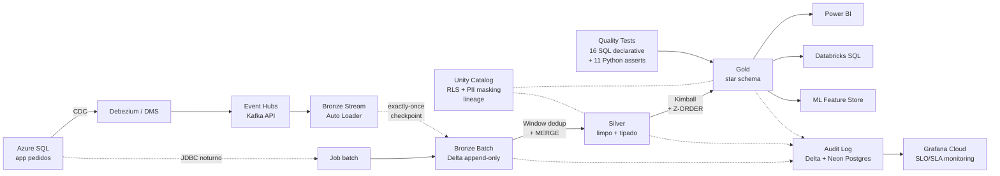

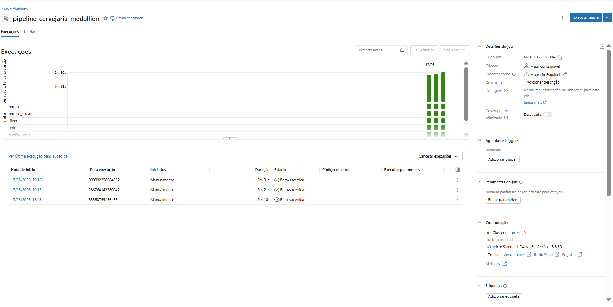

---

## O que esse pipeline entrega

| Métrica | Resultado |
|---|---|
| Faturamento total (60 dias) | R$ 675.342 |
| Top região | Sudeste R$ 324.580 (48%) |
| Top SKU | Colorado Indica 600ml |
| Pico semanal | Sábado R$ 71.463 |
| Pipeline E2E | 2 min 17 s |
| Quality coverage | 27 testes (11 Python asserts + 16 SQL declarativos) |

### Faturamento por região

| Região | Faturamento | Pedidos |
|---|---|---|
| Sudeste | R$ 324.580 | 2.146 |
| Nordeste | R$ 184.202 | 1.148 |
| Sul | R$ 113.696 | 739 |
| Centro-Oeste | R$ 54.445 | 335 |

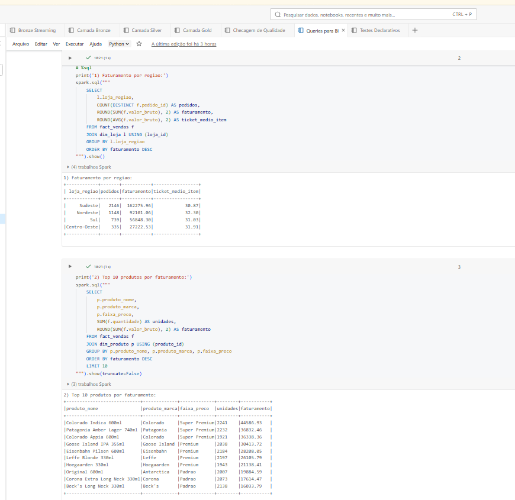
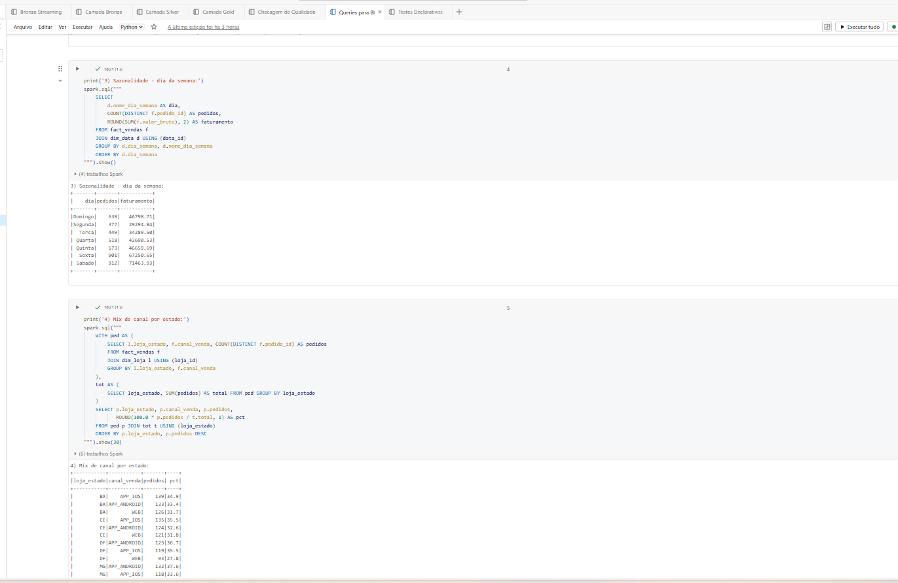

### Observabilidade no Grafana

Dashboard provisionado lendo do Neon Postgres com 480 execuções históricas. Em produção: audit log do Databricks faz dual-write Delta + Postgres (Azure Database for PostgreSQL) que alimenta Azure Managed Grafana.

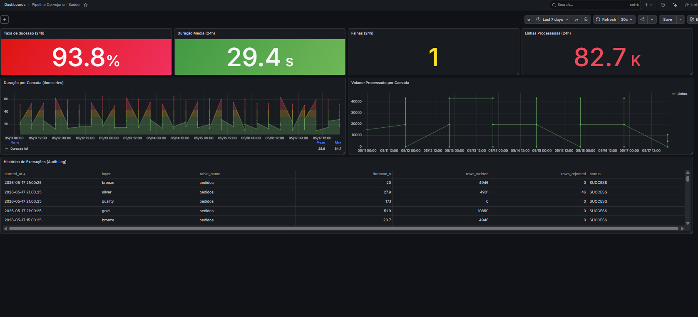

---

## Stack técnico

| Camada | Ferramenta |
|---|---|
| Cloud | Azure (Blob Storage, Databricks) + Neon Postgres + Grafana Cloud |
| Compute | Spark 3.4 / Databricks Runtime 13.3 LTS (MPP) |
| Lakehouse | Delta Lake (ACID, MERGE, Z-ORDER, OPTIMIZE, VACUUM, time travel) |
| Linguagem | PySpark + Spark SQL |
| Streaming | Spark Structured Streaming + Auto Loader (cloudFiles) |
| Orquestração | Databricks Workflows |
| Governance | Unity Catalog (RLS, dynamic views, lineage) |
| Observabilidade | Audit Delta + Postgres + Grafana Cloud |
| IaC | Databricks Asset Bundles + Docker Compose |
| CI/CD | GitHub Actions |
| Modelagem | Kimball star schema |

---

## Estrutura

```
.
├── README.md
├── databricks.yml                          IaC Databricks Asset Bundle
├── .github/workflows/ci.yml                CI completo
├── governance/
│   └── unity-catalog.yml                   Schemas, grants, RLS, masking
├── monitoring/
│   ├── docker-compose.yml                  Grafana + Postgres stack
│   ├── init-metrics-db.sql                 Schema + seed data
│   ├── grafana-provisioning/               Datasource + dashboards config
│   └── README.md
├── gen_orders.py                           Gerador de dados sintéticos
├── data/                                   CSVs (origem simulada)
└── notebooks/
    ├── Setup.ipynb                         Config Blob Storage
    ├── 00_audit_log.ipynb                  Audit table (Delta + Postgres)
    ├── Camada Bronze.ipynb                 Ingestão batch
    ├── Bronze Streaming.ipynb              Auto Loader streaming
    ├── Camada Silver.ipynb                 Dedup + MERGE + DQ
    ├── Camada Gold.ipynb                   Kimball + Z-ORDER + PII
    ├── Queries para BI.ipynb               6 queries de negócio
    ├── Checagem de Qualidade.ipynb         11 Python asserts
    ├── Testes Declarativos.ipynb           16 testes SQL estilo dbt
    └── Analise da Covid.ipynb              Q2 OWID
```

---

## Decisões de design

### Dual ingestion (batch + streaming)

Cenários diferentes. Batch noturno faz reconciliação histórica, garante completude, permite replay. Streaming via Auto Loader cobre near-real-time pra alertas operacionais e feature store de ML. Ambos escrevem Delta em paths separados. No Workflow rodam em paralelo, o que reduz o tempo total do critical path.

### Grão por item na fact_vendas

Pra responder "qual marca mais vendida em SP". Grão por pedido perderia o SKU. Custo: fact 2,4x maior. Ganho: slice and dice por produto, que é o que o stakeholder de marketing precisa.

### MERGE em vez de overwrite na Silver

Overwrite joga histórico fora e impede reprocessamento incremental. MERGE permite rodar o pipeline N vezes no mesmo dia sem duplicar, só atualiza o que mudou. É idempotente.

### Dedup com Window + row_number em vez de dropDuplicates

CDC entrega o mesmo pedido_id com conteúdo diferente quando tem update. Eu preciso da versão MAIS RECENTE. dropDuplicates perde essa noção. Window por _ingestion_timestamp DESC resolve.

### Rateio proporcional da taxa de entrega

Pedido tem UMA taxa de entrega, mas o grão da fact é por item. Se eu somasse a taxa inteira em cada item, o valor_liquido somado daria taxa vezes N (errado). Fórmula: taxa * (subtotal_item / subtotal_pedido). Vi acontecer em projeto anterior, relatório somava taxa duplicada e o financeiro reclamou.

### Z-ORDER em (produto_id, loja_id)

Partition pruning ajuda em filtros temporais (data_id é partition key). Z-ORDER cobre filtros por produto e loja, que BI usa muito. Sem isso o Delta lê todos os arquivos dentro de cada partição. Custo: rodar OPTIMIZE periodicamente.

### PII hash na dim_cliente + Unity Catalog column mask

Email vira SHA-256, nome só primeiro nome. Unity Catalog aplica dynamic view: usuário no grupo pii_access vê em claro, resto vê o hash. Roles diferentes, vista diferente. LGPD compliance.

### Dois layers de Data Quality

Camada 1 (11 asserts Python): schema, regras de negócio óbvias, volumetria. Camada 2 (16 testes SQL estilo dbt): not_null, unique, relationships, accepted_values, expressions, LGPD. Rodam em paralelo no DAG. Se qualquer falhar, raise Exception interrompe o pipeline antes de publicar Gold.

### Audit log com dual-write

Delta no lake (source of truth) + Postgres Neon (alimenta Grafana real-time). Em produção: Azure Data Factory faz o sync ou Databricks SQL Connector escreve direto.

### Databricks Workflows em vez de Airflow

Pra esse caso tudo é Databricks. Workflows já vem integrado, não preciso provisionar Airflow separado, lineage nativo via Unity Catalog, passing de parâmetros entre tasks. Airflow só fariam sentido com orquestração além do Databricks.

### IaC com Asset Bundles

databricks.yml define o job como código. Deploy reprodutível via databricks bundle deploy --target prod. Diferentes targets (dev, staging, prod) com mesma definição.

---

## Execuções

### Bronze (batch) 4.946 pedidos
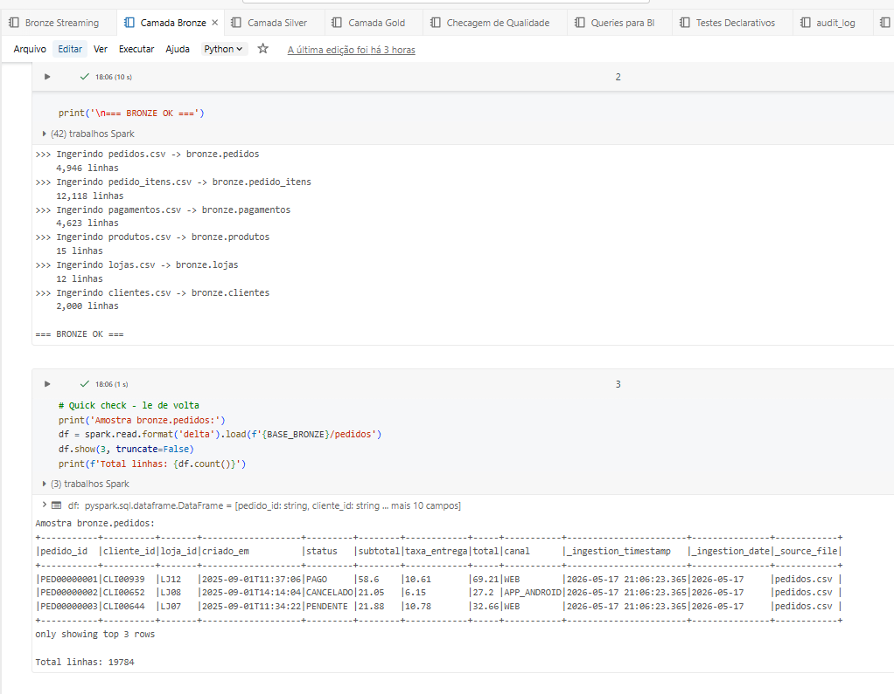

### Silver: 50 duplicados + 20 rejeitados
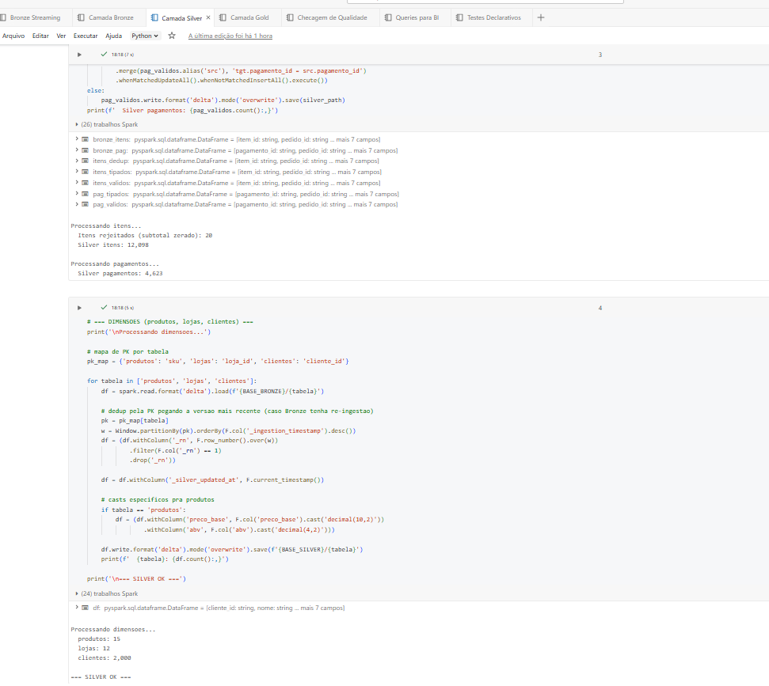

### Gold fact_vendas 10.847 linhas
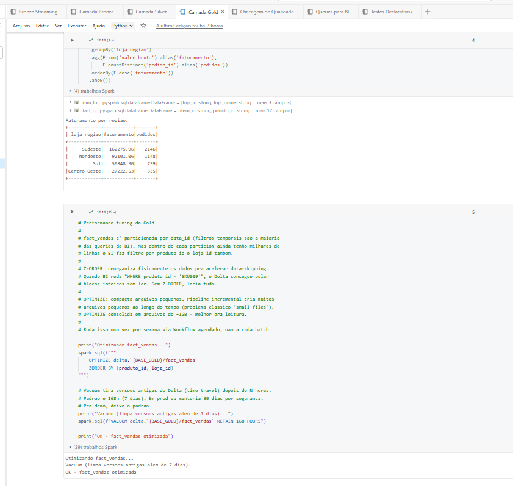

### Quality Checks 11 asserts
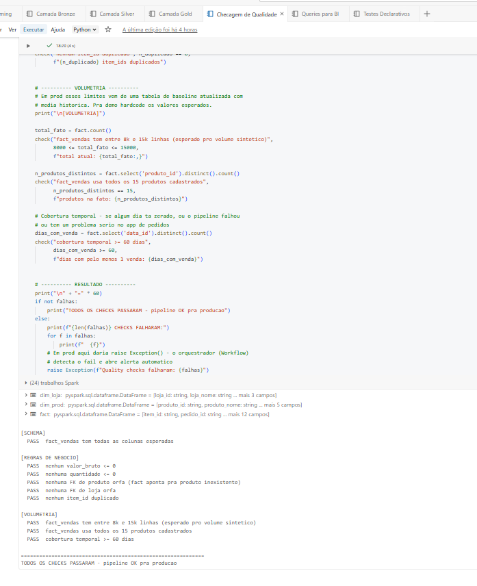

### Testes Declarativos 16 testes SQL
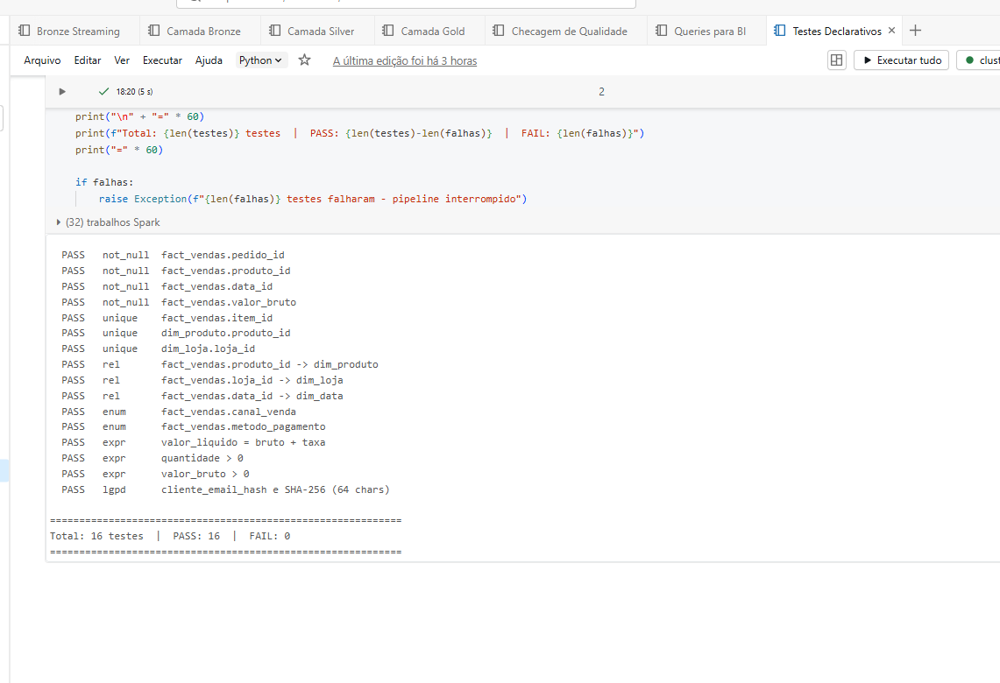

### Workflow DAG e Lista
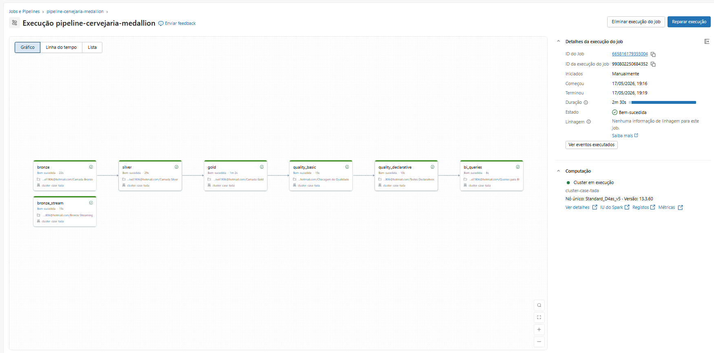

### Blob Storage organizado por camada
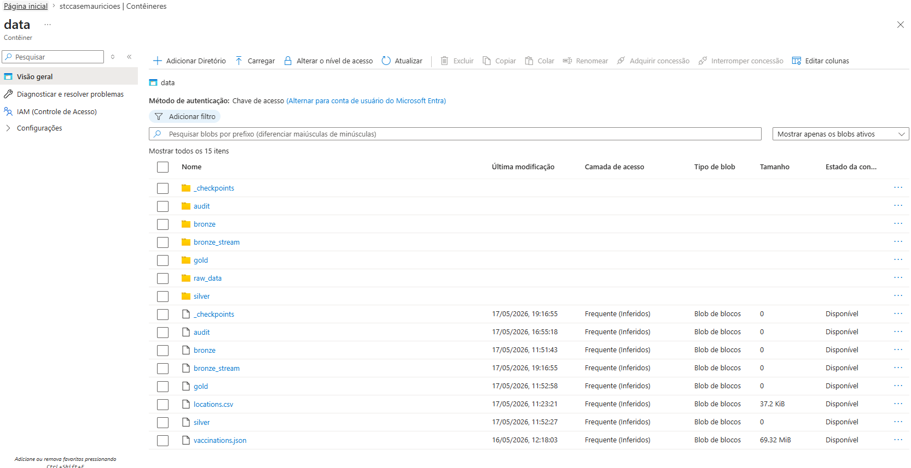

### Análise COVID (Q2)
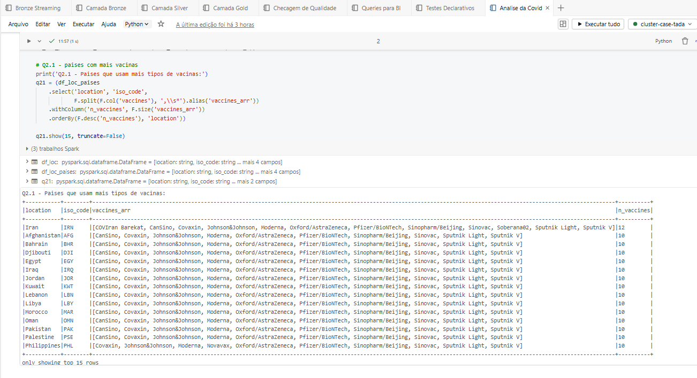
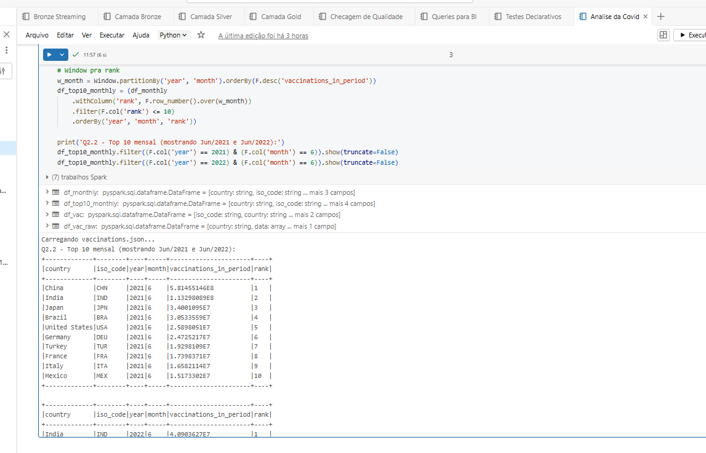
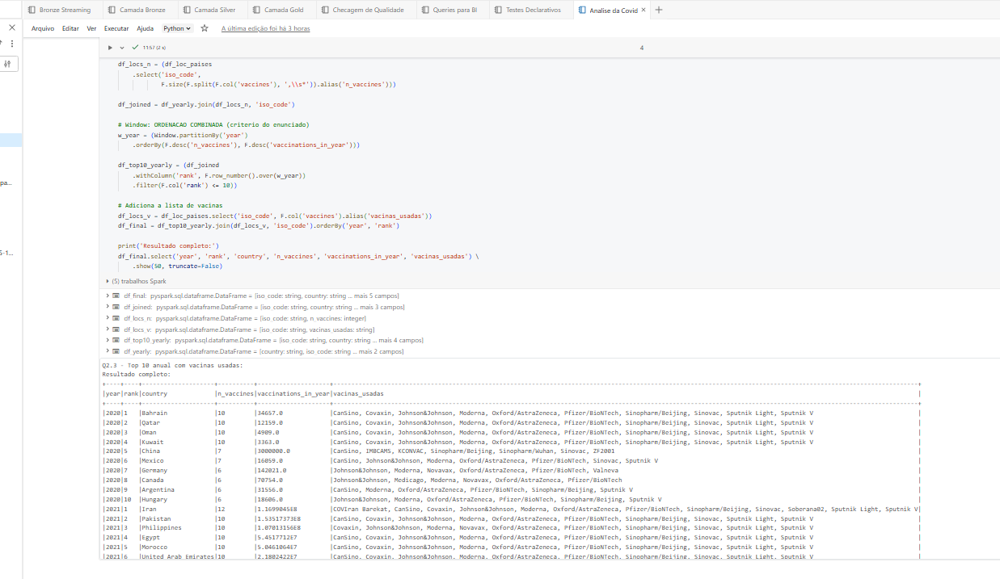

---

## Q2 Análise COVID OWID

Q2.1: Irã lidera com 12 vacinas diferentes (único usando COVIran Barekat + Soberana02 cubana).

Q2.2: Junho de 2021 foi pico mundial. China sozinha aplicou 581 milhões de doses no mês.

Q2.3: Ordenação combinada (n_vaccines DESC, vaccinations DESC) conforme especificação do enunciado.

Pegadinha identificada rodando: dataset OWID inclui agregados regionais (World, Asia, EU, "High income") com iso_code começando em OWID_. Sem filtrar, top 10 fica dominado por "World". Filtro `~F.col('iso_code').startswith('OWID_')` aplicado em todas as queries.

---

## Como reproduzir

```bash
# 1. Gera dados sintéticos
python gen_orders.py

# 2. Sobe CSVs no Azure Blob (data/raw_data/)
# 3. Sobe OWID files (locations.csv, vaccinations.json) na raiz do container
# 4. Importa notebooks no Databricks workspace
# 5. Configura STORAGE_KEY (não está commitada por segurança)
# 6. Cria/executa o Workflow conforme databricks.yml

# Sobe stack de observabilidade local
cd monitoring && docker-compose up -d
# Grafana http://localhost:3000 (admin / cervejaria2025)
```

Em produção:
```bash
databricks bundle deploy --target prod
databricks bundle run pipeline_medallion --target prod
```

---

## Autor

Mauricio Esquivel, Data Engineer  
[github.com/Mauricio1806](https://github.com/Mauricio1806)
